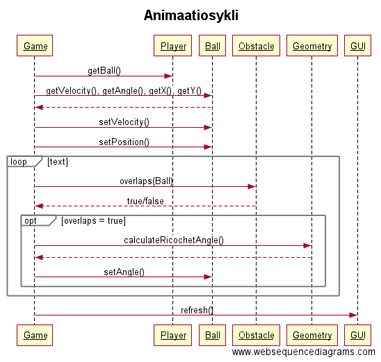
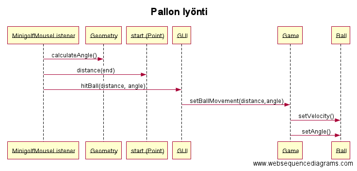

# Minigolf

**Kuvaus:** Yksinkertainen yhden pelaajan minigolfpeli, jossa pelaaja yrittää saada pallon aloituspisteestä kohdepisteeseen määrittämällä lyöntikulman sekä lyöntivoiman hiirtä hyväksi käyttämällä. Lyönnin kulma asteina ja lyöntivoimakkuus määritellään painamalla hiiren nappia ja vetämällä vastakkaiseen suuntaan simuloiden mailan taaksevetoa. Pelialue on koko ruutu, jonka reunat toimivat seininä. Pelialueella on myös esteitä joita välttelemällä/hyöndyntämällä yritetään saada pallo reikään.

### Pelin ohjeet

Palloa "lyödään" painamalla hiiren nappulaa ja raahaamalla hiirtä vastakkaiseen suuntaan kuin pallon halutaan kulkevan. Raahaamisetäisyys määrittää lyöntivoiman. Kun hiirestä päästetään irti, pallo lähtee liikkeelle. Kun pallo saavuttaa kohteena toimivan mustan ympyrän, peli päättyy. Pelitilanteen voi nollata painamalla ruudun alalaidasta löytyvää Reset-nappia.

### Rakennekuvaus

Pelin pääasiallinen hallinnoija on Game-luokka. Se sisältää tiedon pelialueesta ja pallosta. Pelialueluokka LevelArea sisältää esteitä, joiden vaikutusalueelle osuessaan palloinstanssi vaihtaa suuntaansa. Törmäyksentunnistus on esteiden vastuulla. Palloluokka Ball sisältää tiedon sen sijainnista, kulkusuunnasta sekä vauhdista. Game-luokka sisältää pallon liikkeenmuutossimulaation ja käyttää hyväkseen staattisen Geometry-luokan metodeja törmäystilanteissa tapahtuvaa suunnanmuutokseen.

Käyttöliittymäluokka GUI sisältää pelialueen visualisaation esteineen. Pelialue ja pallo piirretään JPanel-luokan perivällä Canvas-luokalla. Canvas sisältää hiiren liikkeitä ja napin painalluksia kuunteleva MinigolfMouseListener:n. Käyttöliittymän ainoa muu syöte on JButton, jolla pelitilanne palautetaan alkutilaan. Sillä on oma kuuntelijaluokkansa ButtonListener.

Pelin main-luokka on Minigolf, joka käynnistää Game:n. Se myös käynnistää käyttöliittymän ja antaa käynnistetyn pelinluokan parametrina.

### Luokkakaavio

### Sekvenssikaavioita

### Raportit

* [PIT-raportti](https://htmlpreview.github.io/?https://github.com/yussiv/Minigolf/blob/master/dokumentaatio/pit-raportti/index.html)
* [Checkstyle-raportti](https://htmlpreview.github.io/?https://github.com/yussiv/Minigolf/blob/master/dokumentaatio/checkstyle-raportti/checkstyle.html)

